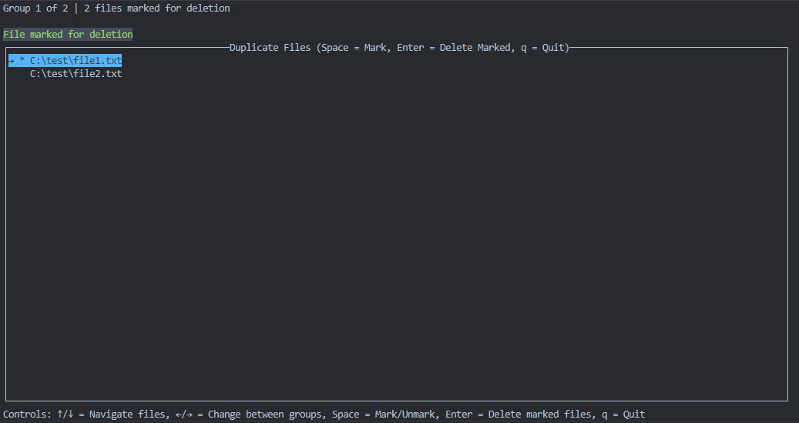
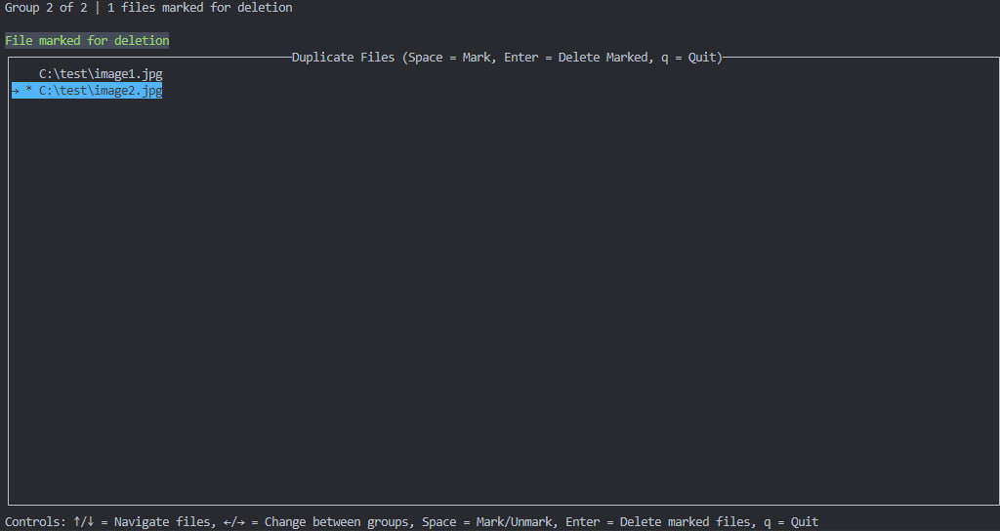

### Duplicate Finder

TUI application written using Brick library for Haskell programming language.
It searches for duplicates in a directory specified by user, user can review the groups of duplicates, mark the files for deletion and remove them.

## Features
- Group navigation of duplicate files
- Mark/unmark files for deletion
- Delete marked duplicates
- Status message with the result of deletion


## Usage
1. Clone the repository:
```
git clone https://github.com/voadosik/Duplicate-Finder.git
cd Duplicate-Finder
```


2. Build the project:
```
cabal build
```

3. Run the program:
```
cabal run duplicate-finder-exe -- "<full directory path>"
```


## Controls
- `↑/↓` - Navigate files
- `←/→` - Change between groups
- `Space` - Mark/Unmark
- `Enter` - Delete marked files
- `q` - quit the application


## Example behaviour
- Test directory contains 2 identical text files and 2 copies of an image
- Group 1 with 2 duplicates of a text file, `file1.txt` marked for deletion:


- Group 2 with 2 duplicates of an image, `image2.jpg` marked for deletion:

